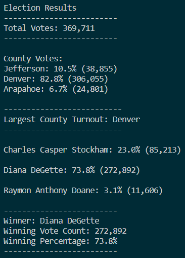
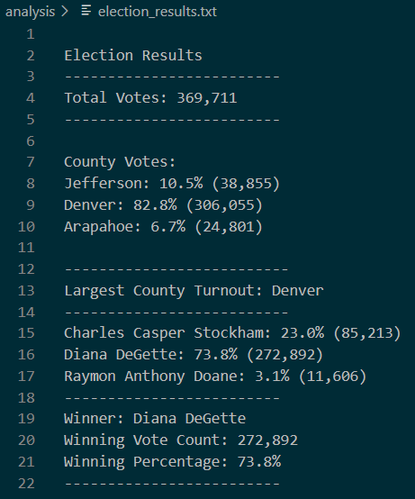

# Election Analysis

## Project Overview
A Colorado Board of Elections employee, Tom, has requested assistance in automating the election audit process using Python. We will need a vote count report to certify this US congressional race. The following are tasks given to complete the election audit of the recent local congressional election.

1. Total number of votes cast
2. A complete list of candidates who received votes
3. Total number of votes each candidate received
4. Percentage of votes each candidate won
5. The winner of the election based on popular vote

## Resources
- Data Source: election_results.csv
- Software: Python 3.7.6, Visual Studio Code, 1.47.3

## Summary
The analysis of the election show that:
- There were "369,711" votes cast in the election.
- The candidates were:
    - Charles Casper Stockham
    - Diana DeGette
    - Raymon Anthony Doane
- The candidate results were:
    - Charles Casper Stockham received "23.0%" of the vote and "85,213" number of votes.
    - Diana DeGette received "73.8%" of the vote and "272,892" number of votes.
    - Raymon Anthony Doane received "3.1%" of the vote and "11,606" number of votes.
 - The winner of the election was:
    - Candidate Diana DeGette, who received "73.8%" of the vote and "272,892" number of votes.
  
## Challenge Overview
### Election-Audit Overview
The election commission has requested some additional data to complete the election audit:

1. The voter turnout for each county
2. The percentage of votes from each county out of the total count
3. The county with the highest turnout

### Election-Audit Results
The analysis of the election show that:
-	There were “369,711” votes cast in this congressional election.
-	The counties involved in this election were:
    - Arapahoe
    - Denver
    - Jefferson
-	The county results were:
    -	“6.7%” of the votes were cast in Arapahoe county with “24,801” number of votes.
    -	“82.8%” of the votes were cast in Denver county with “306,055” number of votes.
    -	“10.5%” of the votes were cast in Jefferson county with “38,855” number of votes.
-	Denver had the largest county turnout.
-	The candidates were:
    -	Charles Casper Stockham
    -	Diana DeGette
    -	Raymon Anthony Doane
-	The candidate results were:
    -	Charles Casper Stockham received "23.0%" of the vote and "85,213" number of votes.
    -	Diana DeGette received "73.8%" of the vote and "272,892" number of votes.
    -	Raymon Anthony Doane received "3.1%" of the vote and "11,606" number of votes.
-	The winner of the election was:
    -	Candidate Diana DeGette, who received "73.8%" of the vote and "272,892" number of votes.
    
### Election Results Screenshots
Output to terminal

Output to text file

## Challenge Summary
### Election-Audit Summary
This congressional election audit was completed successfully with Python. The audit would usually be done in Excel, but we were able to automate the process using Python. By automating the process, we were able to generate the election audit report quicker and with less errors. With a few modifications, the code written to complete this audit can be used for any election, including senatorial districts and local elections. Some examples of how this script can be modified to be used for other elections are:
- the data source file and its path (we can modify the code to use an input function to have the user input the data source file)
- the results output file and its path (we can modify the code to use an input function to have the user input the results output file)
- compatibility with other data source types (we can modify the code to be able to read other data types besides .csv files)
- the variable names to better describe its contents (we can add or remove variables in the code to account for other values tracked in the source file)
